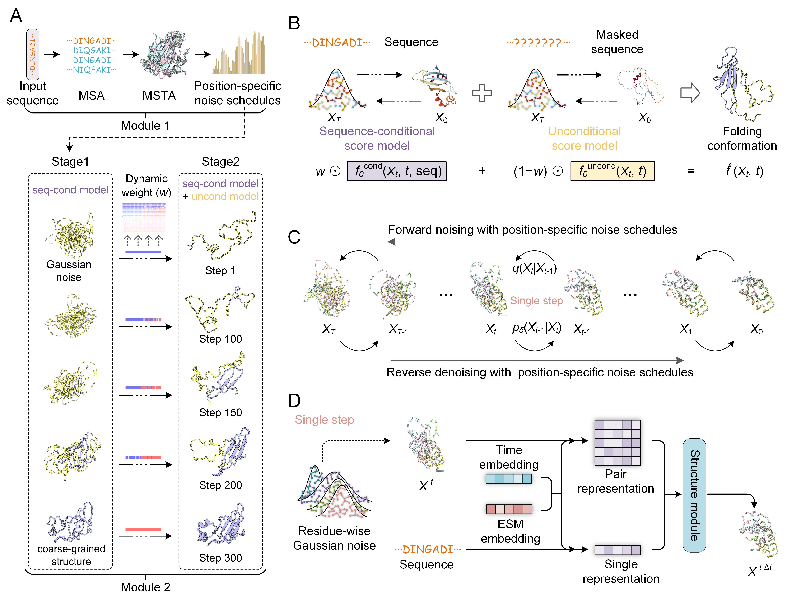

# PathDiffusion

## Overview
PathDiffusion is a software that automatically predicts protein folding pathways using evolution-guided diffusion models.

It comprises two main modules: the first module focuses on preparing position-specific noise schedules (PSNS), and the second module iteratively generates the folding pathway using PSNS-guided diffusion models.

<div align=center></div>
<div align="center">
  
  
</div>

## Installation
```bash
# clone project
git clone https://github.com/YangLab-SDU/PathDiffusion.git
cd PathDiffusion

# create conda virtual environment
conda env create -f env.yml
conda activate PathDiffusion

# install openfold
git clone https://github.com/aqlaboratory/openfold.git
pip install -e openfold
```

## Datasets Preparation
We train PathDiffusion using protein structures from the [Protein Data Bank](https://www.rcsb.org/) (for conditional generation) and the IDRome database (for unconditional generation). Details on dataset preparation can be found in the datasets folder.
The following datasets and pre-computed representations are required:
1. RCSB PDB Dataset: See `datasets/rcsb` for details on downloading and processing structured proteins. Once prepared, specify the `csv_path` and `data_dir` in the configuration file `settings/cond_model.yaml`.
2. MSA and MSTA Generation: After preparing the RCSB dataset, you must generate Multiple Sequence Alignments (MSA) and Multiple Structural Alignments (MSTA) for each protein. Scripts for this process are located in the `run/` directory. Once generated, specify the `msta_dir` in the configuration file `settings/cond_model.yaml`.
3. ESMFold Representations: See `pretrain_repr` for details on extracting embeddings. Once prepared, specify the data_root in the configuration file `settings/cond_model.yaml`.
4. Disordered Protein Dataset: See `datasets/disorder` for details on preparing the IDP dataset. Once prepared, specify the `csv_path` and `data_dir` in the configuration file `settings/uncond_model.yaml`.

## Training
We use Hydra for configuration management. All configuration files are located in the `settings/` directory.

**1. Conditional Training (Fold-based)**:
```bash
python train.py \
    --config-name cond_model \
    task_name=cond_train \
    data.train_batch_size=1 \
    paths.output_dir="./train_model"
```
The detailed training configuration can be found in `settings/cond_model.yaml`.

**2. Unconditional Training (Disorder-based)**:
```bash
python train.py \
    --config-name uncond_model \
    task_name=uncond_train \
    paths.output_dir="./train_model"
```
The detailed training configuration can be found in `settings/uncond_model.yaml`.

## Inference (Sampling)
Use eval.py to generate protein structures. The inference pipeline typically uses Classifier-Free Guidance (CFG) combining both conditional and unconditional checkpoints.
### Basic Command
```bash
python eval.py \
    sampling=cfg_inference \
    model.stage=1 \
    paths.output_dir="./output/inference_result" \
    paths.guidance.cond_ckpt="/path/to/cond_model.ckpt" \
    paths.guidance.uncond_ckpt="/path/to/uncond_model.ckpt" \
    model.score_network.msta_dir="/path/to/msta_dir" \
    data.dataset.test_gen_dataset.csv_path="/path/to/test_data.csv"
```
### Pipeline Automation
For a complete pipeline (MSA and MSTA Generation -> ESM_repr Generation -> Folding Pathway Sampling -> Pathway Movie Generation), you can use the scripts provided in the `run/` directory.
Example:
```bash
bash run/PathDiffusion.sh ./example 1AB7_A
```

## Contact
For questions or issues, please open an issue on this repository.
